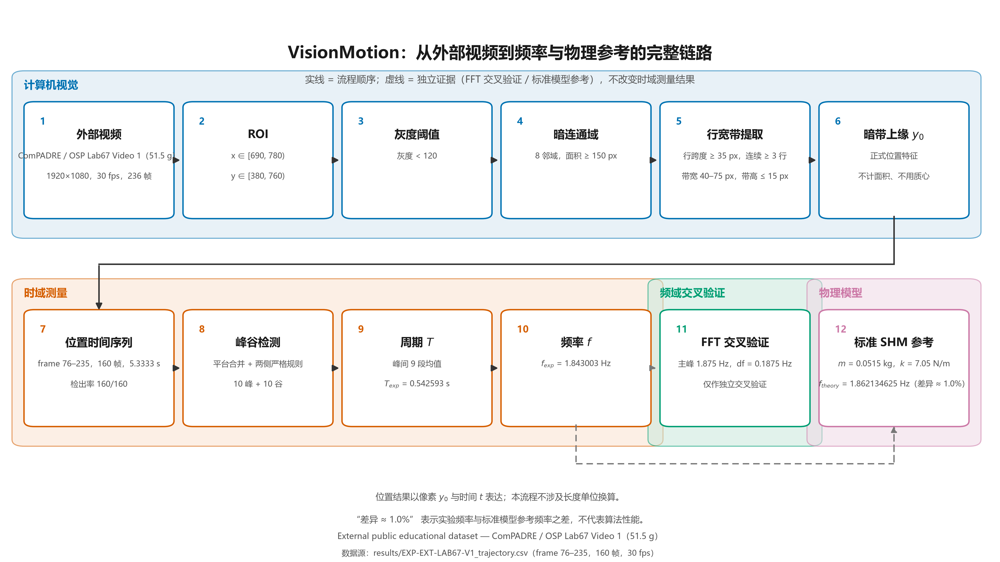
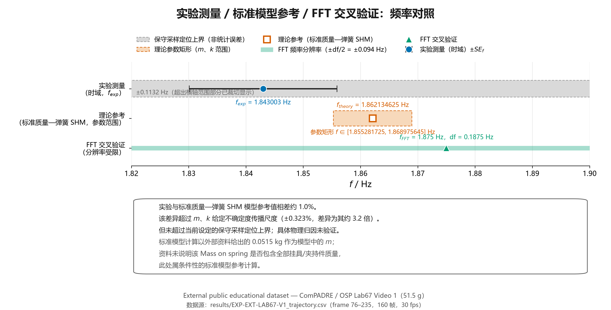

# VisionMotion

**基于计算机视觉的低成本、非接触式位移与振动监测项目**

## 1. 项目简介

**一句话：基于 OpenCV 的视频目标检测、轨迹提取、标定、位移分析与振动频率分析项目。**

VisionMotion 是一个基于计算机视觉的低成本、非接触式位移与振动监测项目：用普通摄像设备拍摄机械目标的运动视频，通过可解释的图像处理得到目标位置的时间序列，并据此测量振动周期与频率、做频域交叉验证，最后与基础物理模型作条件性对照。

核心链路：

```text
视频 → 目标视觉特征 → 位置时间序列 y₀(t) → 周期 T → 频率 f → FFT 交叉验证 → 标准 SHM 条件性参考
```

本项目**不使用深度学习或复杂跟踪算法**，重点在于：整条测量链路能够跑通、每一步都能解释清楚、结果可以复现。

### 30 秒速览：输入 → 运行 → 输出

```text
输入
图片 / 视频
  ↓
OpenCV 目标检测（颜色阈值 + 几何规则，不使用深度学习）
  ↓
轨迹 CSV（逐帧像素坐标时间序列）
  ↓
标定 + 位移计算（px/mm；静态 / 动态）
  ↓
时域 / 频域分析（峰谷 → 周期 T → 频率 f → FFT 交叉验证）
  ↓
成果图与实验报告
```

**最小演示命令**（约 3 秒，只读仓库内已有结果数据）：

```powershell
.\.venv\Scripts\python.exe demo\run_m63_final_visualization.py
```

- 不需要外部视频、不需要硬件、不需要 GUI 窗口；
- 使用仓库内已有结果数据 `results/EXP-EXT-LAB67-V1_trajectory.csv`；
- 终端逐条打印自检，并给出 `自检结论：全部通过`；
- 最后得到三张成果图：`fig_A`（到底测到了什么）、`fig_B`（与物理模型参考值的对照）、`fig_C`（完整技术链）。





📖 [正式用户使用指南](docs/USER_GUIDE.md)（面向第一次使用的普通用户）
🛠️ [开发者 / 科研使用指南](docs/DEVELOPER_GUIDE.md)（面向替换数据、复现实验与二次开发）
🎓 [源码学习课程索引](docs/learning/COURSE_INDEX.md)（面向源码与课程化学习）

## 2. 为什么做这个项目

- 普通摄像头的视频里，能否提取出**可重复**的运动位置特征？
- 如何从像素位置序列中测量出振动的**周期与频率**？
- 如何用独立的频域方法（FFT）对时域测量做**交叉验证**？
- 如何把视觉测量结果与基础物理模型（质量—弹簧简谐振动）联系起来，并**诚实说明差异与证据边界**？

## 3. 当前项目状态

**M0–M7 已完成**，当前处于最终交付与展示打磨阶段。

> **关于编号**：M0–M7 是项目内部的实验 / 里程碑编号，**不是软件版本号**；编号允许跳号（例如下表中没有 M6.1），这里只列出有正式结果或正式结论的里程碑。

| 里程碑 | 内容 | 状态 |
| --- | --- | --- |
| M1 | 开发环境搭建与依赖验证 | 已完成 |
| M2 | 单张图片视觉目标检测 | 已完成 |
| M3 | 视频目标逐帧跟踪与时序坐标提取 | 已完成 |
| M4 | 静态 px/mm 标定与静态位移测量 | 已完成 |
| M5 | 动态位移与运动轨迹实验 | 已完成 |
| M6.2 | 外部公开教育视频的视觉特征选择与正式轨迹提取 | 已完成 |
| M6.3 | 周期 / 频率测量、FFT 交叉验证、标准 SHM 条件性参考、不确定度与证据边界、最终可视化 | 已完成 |
| M7 | 交付整理：最终报告、README、答辩 PPT 与文档一致性 | 已完成 |

## 4. 数据来源

本项目的**外部验证数据**为公开教育数据集：

| 项目 | 内容 |
| --- | --- |
| 来源 | ComPADRE / Open Source Physics（OSP），条目 ID **16081** |
| 标题 | Teaching Harmonic Motion Online Using Tracker |
| 使用资源 | **Lab67 Video 1**（质量标签 51.5 g = 0.0515 kg） |
| 视频参数 | 1920 × 1080，30 fps，236 帧（总长约 7.87 s） |
| 正式分析区间 | **frame 76–235**（160 帧，5.3333 s） |
| 数据性质 | **External public educational dataset**（外部公开教育数据，**不是**本项目自行采集） |
| 视频 SHA-256 | `dbc81382e93d2b531b7390f1d52f275da5ea9731a9eec9aadb059667944e282d` |

作者 / 权益持有人与许可（CC BY-NC-SA 3.0）详见 [`docs/ATTRIBUTION.md`](docs/ATTRIBUTION.md)。

## 5. 核心方法

```text
外部视频 → ROI → 灰度阈值 → 暗连通域 → 行宽带 → 暗带上缘 y₀ → y₀(t) → 峰谷检测 → T → f
```

正式检测规则（M6.2-2B 冻结，M6.2-2C 实现）：

| 环节 | 规则 |
| --- | --- |
| ROI | x ∈ [690, 780)，y ∈ [380, 760) |
| 灰度阈值 | gray < 120 |
| 暗连通域 | 8 邻域连通，面积 ≥ 150 px |
| 行宽带 | 行跨度 ≥ 35 px，连续 ≥ 3 行 |
| 几何筛选 | 带宽 40–75 px，带高 ≤ 15 px |
| **正式位置特征** | **暗带上缘 y₀**（不是面积、质心或下缘） |

- 正式区间检出率 **160 / 160**，无缺口、无锁错帧；
- frame 74–75 在冻结规则下无法形成合格暗带 → **保持缺失**，未通过放宽规则强行补值；
- frame 0–73 为释放前/过渡阶段，仅作诊断参考，不进入正式轨迹。

## 6. 主要结果

| 量 | 结果 |
| --- | --- |
| 周期（时域，峰—峰 9 段均值） | **T_exp = 0.542593 s** |
| 频率 | **f_exp = 1.843003 Hz** |
| FFT 交叉验证 | 主峰 **1.875 Hz**，频率分辨率 **df = 0.1875 Hz**（仅作独立交叉验证，不替代时域测量） |
| 标准 SHM 条件性参考 | m = 0.0515 kg、k = 7.05 N/m → **f_theory = 1.862134625 Hz**（T_theory = 0.537018101 s） |
| 实验值与参考值差异 | **约 1.0%**（周期 +1.0381%、频率 −1.0274%） |

说明：该差异**超过** m、k 给定不确定度的传播尺度（±0.3228%），但**未超过**本项目设定的保守采样定位上界（周期 ±0.0333 s、频率 ±0.1132 Hz）；由于缺少弹簧自身质量、挂具/夹持件总质量与阻尼参数等独立测量，**当前不能将该差异归因于某一个具体物理因素**。

（"约 1.0%" 指实验频率与标准模型参考频率之间的差异，**不代表**算法性能指标。该标准模型为**项目采用**的标准质量—弹簧 SHM 模型，非外部实验资料明文给出。）

## 7. 最终成果图

| 图 | 文件 | 用途 |
| --- | --- | --- |
| 图 A | [`results/EXP-EXT-LAB67-V1_fig_A_y0_timeseries.png`](results/EXP-EXT-LAB67-V1_fig_A_y0_timeseries.png) | 回答"我到底测到了什么"：160 个原始采样点、10 个局部极大与 10 个局部极小、单处代表性峰—峰区间 |
| 图 B | [`results/EXP-EXT-LAB67-V1_fig_B_frequency_comparison.png`](results/EXP-EXT-LAB67-V1_fig_B_frequency_comparison.png) | 回答"测出来的结果与物理模型一致到什么程度"：实验测量 / 标准模型参考 / FFT 交叉验证的对照 |
| 图 C | [`results/EXP-EXT-LAB67-V1_fig_C_pipeline.png`](results/EXP-EXT-LAB67-V1_fig_C_pipeline.png) | 回答"我是怎么从视频走到这个结果的"：完整技术流程（计算机视觉 → 时域测量 → 频域交叉验证 → 物理模型） |

## 8. 如何运行

在项目根目录下执行。**M2 与 M3 已支持命令行参数**（`--input` / `--out-dir` / `--overwrite`），用法见下方「M2 / M3 的命令行参数（推荐用法）」；其余 demo 仍是**无命令行参数**脚本（输入输出路径写在脚本内部）。

| 阶段 | 命令 | 是否需要仓库之外的本地数据 |
| --- | --- | --- |
| M2 | **推荐**：`.venv\Scripts\python.exe demo\run_single_image_detection.py --input data\raw\my_image.jpg --out-dir results\my_image`<br>兼容旧流程：`.venv\Scripts\python.exe demo\run_single_image_detection.py` | 是（`--input` 指定的图片；无参数时用 `data/raw/EXP-001-IMAGE-001.jpg`） |
| M3 | **推荐**：`.venv\Scripts\python.exe demo\run_video_tracking.py --input data\raw\my_video.mp4 --out-dir results\my_video`<br>兼容旧流程：`.venv\Scripts\python.exe demo\run_video_tracking.py` | 是（`--input` 指定的视频；无参数时用 `data/raw/EXP-002-VIDEO-001.mp4`） |
| M4 | `.venv\Scripts\python.exe demo\pick_calibration_points.py`（交互式取点）<br>`.venv\Scripts\python.exe demo\run_m43_displacement.py` | 是（`data/raw/EXP-003-*.mp4`） |
| M5 | `.venv\Scripts\python.exe demo\run_m52_dynamic_displacement.py`<br>`.venv\Scripts\python.exe demo\run_m53_plot.py` | 前者需要 `data/raw/EXP-004-DYNAMIC-001.mp4`；后者只需仓库内已有的 `results/EXP-004-DYNAMIC-001_ds.csv` |
| M6.2 | `.venv\Scripts\python.exe demo\run_m62_external_tracking.py` | 是（`_external/_candidates/candidate_comPADRE_Lab67_01_Video1_51p5g.mp4`） |
| M6.3 | `.venv\Scripts\python.exe demo\run_m63_final_visualization.py` | **否**（只需仓库内 `results/EXP-EXT-LAB67-V1_trajectory.csv`） |
| M7.3 | `.venv\Scripts\python.exe src\m73_presentation.py`（位于 `src/`，**不是 demo**；生成最终 PPT） | 否（使用仓库内成果图与冻结结果） |

说明：

- `data/raw/` 的自采原始视频与 `_external/` 的第三方公开视频**均未随仓库分发**（体积大 / 第三方数据），因此 M2–M6.2 的 demo 需要本地具备相应文件才能重跑；**M6.3 只需仓库内的封板轨迹 CSV 即可重跑**。
- 在已激活虚拟环境的终端中，上述命令亦可简写为 `python demo\run_xxx.py`。
- `M7.3` 的入口是 `src/m73_presentation.py`（**不在 `demo/` 下**），用于生成最终展示材料 `docs/VisionMotion_Final_Presentation.pptx`；本表其余条目均为 `demo/` 下的脚本。
- M4 的 `run_m43_displacement.py` 会按冻结规则为每个视频生成 `_ds.csv`；若某段视频起始窗口（`S0_WINDOW_S`）内的有效帧不足 `MIN_S0_VALID_FRAMES`，则**不会写出该视频的 `_ds.csv`**——这是正常的冻结行为，不代表程序失败（例如当前 `EXP-003-STATIC-001` 只有 `_track.csv` 与 overlay，没有 `_ds.csv`）。
- M4 / M5 还会先看上游 M3 的轨迹完整性：`suspect` / `unverified` 时**继续计算但给出警告**，`not_evaluated`（用户主动中断）时**跳过该视频的位移计算、不生成 `_ds.csv`**（详见 [USER_GUIDE §9](docs/USER_GUIDE.md) 与 [DEVELOPER_GUIDE §7](docs/DEVELOPER_GUIDE.md)）。

### 克隆仓库后：可以直接做什么 / 不能直接做什么

**可以直接做：**

- 运行 **M6.3 最终可视化**（`demo\run_m63_final_visualization.py`）——只用仓库内已有的封板轨迹 CSV，即可重新生成三张成果图；
- 查看仓库附带的**最终实验结果**：`results/EXP-EXT-LAB67-V1_*` 成果图与轨迹 CSV、早期实验的 `_track.csv` / `_ds.csv`；
- 安装依赖后运行项目自带测试（`pip install -r requirements-dev.txt` 后 `pytest`）。

**不能直接做（需要你自己补素材）：**

- `data/raw/` 中的**原始实验图片 / 视频不随仓库分发**（体积大），因此 M2 / M3 / M4 / M5 的 demo 需要你本地提供输入文件；
- `_external/` 中的**第三方公开视频不随仓库分发**，因此 M6.2 需要你自行准备该视频；
- 被 `.gitignore` 排除的 **overlay MP4 不保证存在**（`EXP-003-*`、`EXP-004-*` 的叠加视频只在生成本机上有）。

### M2 / M3 的命令行参数（推荐用法）

M2（`demo/run_single_image_detection.py`）与 M3（`demo/run_video_tracking.py`）使用**完全一致**的命令行接口：`--input` / `--out-dir` / `--overwrite`。

**M2（图片）**：

```powershell
.\.venv\Scripts\python.exe demo\run_single_image_detection.py `
  --input data\raw\my_image.jpg `
  --out-dir results\my_image
```

```text
results\my_image\my_image_overlay.png
results\my_image\my_image_mask.png
```

**M3（视频）**：

```powershell
.\.venv\Scripts\python.exe demo\run_video_tracking.py `
  --input data\raw\my_video.mp4 `
  --out-dir results\my_video
```

```text
results\my_video\my_video_track.csv
results\my_video\my_video_overlay.mp4
```

两者共同的规则：

- `--input`：输入图片 / 视频路径（用户输入）；`--out-dir`：输出目录（用户输入；目录不存在时自动创建）；
- 输出文件名由输入文件名（`Path.stem`）**自动派生**，不需要手工命名，也不会再借用 `EXP-001-…` / `EXP-002-…` 这类历史实验名；
- **默认不覆盖已有输出**：只要显式用了 `--input` 或 `--out-dir`，目标文件已存在时程序会**停止并提示**，不会静默覆盖上一次的结果；
- 确认要覆盖时，显式加 `--overwrite`——它只是**文件管理行为**，不会关闭任何检测 / QC / SHA 检查；
- 相对路径一律按**项目根目录**解析（不是当前 shell 的工作目录）；绝对路径原样使用；
- CLI 只负责**用户输入与输出管理**：M2 的 HSV / `MIN_AREA` 等检测参数，M3 的检测参数 / FPS / QC / SHA，都**不是**命令行参数。

**退出码（供脚本 / 自动化判断，摘要）**：

| 退出码 | 含义 |
| --- | --- |
| `0` | 处理完成（M3 还要求轨迹完整且 CSV 自检通过） |
| `1` | 输入 / 处理 / 写入错误，或 CSV 自检未通过 |
| `2` | 输出文件冲突（未加 `--overwrite`）；argparse 用法错误默认也是 `2` |
| `3` | 流程正常完成，但没有检测到目标（零检出） |
| `4` | 用户按 `Ctrl+C` 中断逐帧处理（仅 M3） |
| `5` | 轨迹完整性存疑或未验证（`suspect` / `unverified`，仅 M3） |

退出码只是机器可读信号，不替代终端输出；**部分漏检（例如 170 帧中检出 80 帧）仍然是 `0`**，只有全程零检出才是 `3`。完整表格与逐条解释见 [USER_GUIDE §5 / §6](docs/USER_GUIDE.md) 与 [DEVELOPER_GUIDE §4 / §5](docs/DEVELOPER_GUIDE.md)。

**无参数兼容（旧教程仍然有效）**：

```powershell
.\.venv\Scripts\python.exe demo\run_single_image_detection.py
.\.venv\Scripts\python.exe demo\run_video_tracking.py
```

不带参数时，它们分别固定使用 `data/raw/EXP-001-IMAGE-001.jpg` 与 `data/raw/EXP-002-VIDEO-001.mp4`，输出写回 `results/` 里的旧历史文件名。**这是为兼容旧教程保留的默认行为，不启用覆盖保护，也不是推荐用来处理自己数据的方式**；处理自己的数据请使用 `--input` / `--out-dir`。

> M2 得到的是像素中心坐标，M3 得到的是**像素坐标时间序列**（`x_px` / `y_px`），都不是毫米位移；毫米位移要经过 M4 标定。

### 标定说明（重要）

`demo/pick_calibration_points.py` 是**交互式人工标定工具**：它打开 `data/raw/EXP-003-STATIC-002.mp4` 的第 900 帧，由用户依次点选 10 cm / 16 cm 刻线，然后调用 `src/calibration.py` 计算并**只在终端打印** `k`（px/mm）与单位方向 `u`（该脚本不保存结果图片、不写 CSV、不写配置文件）。

**它不会把标定结果写入任何文件，也不会自动传给后续 M4 / M5 管线。** 后续位移计算使用的是写死在源码里的"冻结标定常量"：

- `src/displacement.py`（EXP-003，60 mm 标定）：`CALIB_P1_PX`、`CALIB_P2_PX`、`CALIB_REAL_DISTANCE_MM`、`PX_PER_MM`、`MM_PER_PX`、`U`（当前位于该文件第 48–55 行附近），以及配套的 valid gate 与 s0 规则。
- `src/dynamic_displacement.py`（EXP-004，100 mm 标定）：`CALIB_P1_PX`、`CALIB_P2_PX`、`CALIB_REAL_DISTANCE_MM`、`PX_PER_MM_004`、`MM_PER_PX_004`、`U_004`（当前位于该文件第 60–66 行附近），以及 EXP-004 专属 gate 与 s0 规则。

因此，普通用户不要以为"点选两个点 → 后面就会自动完成毫米位移"。**更换实验视频后，若要进行新的 M4 / M5 位移计算，高级用户需要根据新的标定结果人工更新对应模块中的冻结标定常量**（及相应的 gate / s0 规则），然后重新执行脚本内置的 QC 自检。本项目当前**没有**把标定做成命令行参数或配置文件，本阶段也不做这类通用化改造。

## 9. 环境

依赖见 [`requirements.txt`](requirements.txt)（当前共五项：核心运行期库为 opencv-python / numpy / matplotlib，另有 Pillow 与 python-pptx 用于结果图片与 PPT 归档输出；未引入额外框架）：

| 库 | 用途 |
| --- | --- |
| `opencv-python` | 视频读取、图像预处理、阈值分割、轮廓检测 |
| `numpy` | 数组运算、质心与基础统计 |
| `matplotlib` | 位移-时间曲线与最终成果图 |
| `Pillow` | 结果 PNG 的读回校验（尺寸 / 可打开性）与 PPTX 图片素材处理 |
| `python-pptx` | M7.3A 最终展示材料（`.pptx`）的生成 |

建立环境（Windows PowerShell）：

```powershell
python -m venv .venv
.\.venv\Scripts\Activate.ps1
pip install -r requirements.txt
```

Windows CMD 用户把中间一行换成：

```bat
.venv\Scripts\activate.bat
```

说明：PowerShell 的激活脚本是 `Activate.ps1`，必须带 `.\` 前缀；若提示"禁止运行脚本"，属于执行策略限制，本项目只把**当前用户**执行策略设为 `RemoteSigned`（`Set-ExecutionPolicy -Scope CurrentUser -ExecutionPolicy RemoteSigned`；恢复默认值用 `Set-ExecutionPolicy -Scope CurrentUser -ExecutionPolicy Undefined`），不要为此放宽到 `Unrestricted`，也不要改动计算机级策略。

本项目在 Python 3.14.1 + opencv-python 5.0.0.93 + numpy 2.5.3 + matplotlib 3.11.2 环境下验证通过（M1）。

若需运行测试，请额外安装 `requirements-dev.txt`（`pip install -r requirements-dev.txt`）；pytest 不属于项目运行期依赖。

## 10. 输出文件

| 类型 | 文件 |
| --- | --- |
| 正式轨迹（外部公开视频） | [`results/EXP-EXT-LAB67-V1_trajectory.csv`](results/EXP-EXT-LAB67-V1_trajectory.csv)（frame 76–235，160 行） |
| 最终成果图 | `results/EXP-EXT-LAB67-V1_fig_A_y0_timeseries.png`、`..._fig_B_frequency_comparison.png`、`..._fig_C_pipeline.png` |
| 最终报告 | [`docs/M6.3_FINAL_REPORT.md`](docs/M6.3_FINAL_REPORT.md) |
| 早期阶段结果 | `results/EXP-00X-*_track.csv`、`*_ds.csv`、`EXP-004-DYNAMIC-001_displacement.png`、`EXP-001-IMAGE-001_mask.png` 等 |

## 11. 项目局限

1. 本阶段使用**外部公开教育视频**，不是自主采集的实验数据；
2. 当前仅有**单一视频、单一质量**（51.5 g），未做跨视频 / 跨质量的一致性验证；
3. 该外部视频为 **30 fps**，限制了极值时刻的时间定位精度（单帧 0.0333 s）；
4. 正式位置结果以**像素位置 y₀** 表达；
5. 本阶段**未为该外部公开视频建立并应用有效的动态 px/mm 标定**，因此暂不能给出毫米位移与振幅；
6. 正式数据记录长度仅 **5.3333 s**，FFT 频率分辨率有限（df = 0.1875 Hz）；
7. 未进行阻尼、有效质量等物理参数的**独立测量**；
8. 实验值与标准模型参考值之间约 1.0% 差异的**具体物理原因未验证**。

## 12. 最终报告

[`docs/M6.3_FINAL_REPORT.md`](docs/M6.3_FINAL_REPORT.md) 包含：数据源、视觉测量方法、位置信号 y₀(t)、峰谷与周期、FFT 交叉验证、标准 SHM 条件性参考、实验—参考差异、三层不确定度与证据边界、未验证因素、技术链、项目限制与结论。

## 13. 数据与来源说明

第三方数据来源、作者、条目 ID、许可与视频哈希：见 [`docs/ATTRIBUTION.md`](docs/ATTRIBUTION.md)。

## 14. 作者

深圳大学 光电信息科学与工程专业本科生。个人简介见 [`docs/AUTHOR_PROFILE.md`](docs/AUTHOR_PROFILE.md)。

## 15. License

本项目代码采用 **MIT License**（Copyright (c) 2026 yangzi0808），全文见仓库根目录 [`LICENSE`](LICENSE)。第三方公开数据（ComPADRE / OSP Lab67 Video 1）的许可为 **CC BY-NC-SA 3.0**，详见 [`docs/ATTRIBUTION.md`](docs/ATTRIBUTION.md)。

## 16. GitHub Repository

本项目仓库地址：<https://github.com/yangzi0808/VisionMotion>

（项目内容位于该仓库的 `master` 分支；仓库默认分支如需切换，请在 GitHub 仓库设置中手动将默认分支设为 `master`。）

> 注意：这是个人项目仓库，**本地 `master` 可能领先于 GitHub 上已发布的内容**。如果要以最新版本对外展示，请先确认本地与 `origin/master` 的推送状态是否一致。

## 17. 如何放入自己的图片 / 视频

把素材放进**项目根目录**下的 `data/raw/`（该目录不随仓库分发，需要你自己准备）：

```powershell
Copy-Item ".\your_video.mp4" ".\data\raw\"
Copy-Item ".\your_image.jpg" ".\data\raw\"
```

> **`.data` 不是项目运行依赖。** 项目所有脚本只认项目根目录下的 `data/`；本文档中的路径一律以 **`<项目根目录>`** 为基准。

**M3（视频）与 M2（图片）支持直接指定输入，不需要改名成 `EXP-002-VIDEO-001.mp4` / `EXP-001-IMAGE-001.jpg`：**

```powershell
.\.venv\Scripts\python.exe demo\run_video_tracking.py --input data\raw\your_video.mp4 --out-dir results\your_video
.\.venv\Scripts\python.exe demo\run_single_image_detection.py --input data\raw\your_image.jpg --out-dir results\your_image
```

输出文件名自动跟随输入文件名：`results\your_video\your_video_track.csv`、`your_video_overlay.mp4`；`results\your_image\your_image_overlay.png`、`your_image_mask.png`。

其余 demo（M4 / M5 / M6.2 / M6.3 / M7.3）暂无命令行参数，输入路径写在脚本内部；要换成自己的数据，请把文件按脚本期望的路径与文件名放好，或直接修改脚本内的路径常量（例如 M4 的标定工具固定读 `data/raw/EXP-003-STATIC-002.mp4`）。

### 终端位置

本文档所有命令都假设**当前工作目录是项目根目录**：

```powershell
cd <项目根目录>
```

`--input` / `--out-dir` 的相对路径按**项目根目录**解析；如果从其它目录执行，请改用指向项目根目录的绝对路径。

## 18. 常见问题 / FAQ（排错入口）

### 1. 提示"原始图片 / 视频不存在"，找不到输入文件

- 自采实验素材放在 `data/raw/`（图片与视频均可），例如 `data/raw/EXP-002-VIDEO-001.mp4`。
- 外部公开视频放在当前实际使用的 `_external/_candidates/` 下，例如 M6.2 读取的 `_external/_candidates/candidate_comPADRE_Lab67_01_Video1_51p5g.mp4`。
- **M2 / M3 已支持命令行参数**：`demo/run_single_image_detection.py` 与 `demo/run_video_tracking.py` 都可以用 `--input` / `--out-dir` / `--overwrite` 换输入文件，不必改源码（见 §8「M2 / M3 的命令行参数（推荐用法）」）。输入不存在时分别给出 `错误：输入图片不存在：<绝对路径>` 与 `错误：输入视频不存在：<绝对路径>`。
- 其余 demo（M4 / M5 / M6.2 / M6.3 / M7.3）仍是**无命令行参数**脚本，输入路径写在脚本内部（例如 M4 的标定工具固定读 `data/raw/EXP-003-STATIC-002.mp4`）。文件缺失时脚本会打印清晰错误并停止；若要换成自己的文件，需按 §17 放到对应路径、改成脚本期望的文件名，或直接修改脚本内的路径常量。

### 2. 中文字体缺失导致出图失败

- 需要中文字体的入口是 `demo/run_m53_plot.py` 与 `demo/run_m63_final_visualization.py`（后者调用 `src/m63_final_visualization.py`）。
- `run_m53_plot.py` **固定**使用 `C:\Windows\Fonts\msyh.ttc`（Microsoft YaHei）；文件不存在时会打印"错误：冻结字体不存在"并停止，不会自行换字体。
- `m63_final_visualization.py` 会按 `Microsoft YaHei → SimHei → DengXian → SimSun → …` 的顺序自动挑选**实际存在**的中文字体；一个都找不到时会报错并停止。
- 解决办法（Windows）：安装微软雅黑，或让上述候选字体之一可用即可，无需改动代码。本项目当前**未声明支持 Linux / macOS 的字体路径**。

### 3. OpenCV 窗口打不开（涉及 `demo/pick_calibration_points.py`）

- 只有 `demo/pick_calibration_points.py` 这一步需要弹出 OpenCV 交互窗口（用鼠标点选 P1 / P2）。
- 在无图形界面的环境（远程 / 无桌面会话）里窗口无法弹出，该步骤无法完成：程序会卡在或错过"等用户点击 / 按 Enter 确认"的环节，不会计算 `k`、`u`，也不会写任何文件。
- 其它 demo（M2 / M3 / M5 / M6.2 / M6.3）不需要 GUI 窗口，可在无界面环境运行。

### 4. SHA-256 校验不匹配（视频 / CSV 不是对应冻结版本）

- 项目对关键输入做 SHA-256 校验，用于确认你手上的文件**与冻结记录完全一致**（例如 M5.2 的原始视频、M6.2 的外部视频、M5.3 的封板 ds CSV）。
- 常见失败原因：文件被替换 / 重新导出 / 重新生成（字节不同）、下载来源不同、或文件被移动混用。
- **不要通过删除代码里的 SHA 校验来"绕过"**：校验失败通常意味着输入不是对应的冻结版本，删掉校验会让结果失去可追溯性。
- 正确做法：核对你手上的文件是否就是该阶段记录的对应版本（外部视频哈希见 §4；各脚本运行时也会打印期望值），放回正确文件后重试。

### 5. 叠加视频失败、输出回退为代表性 PNG（`demo/run_video_tracking.py`）

> 下文的 `EXP-002-VIDEO-001_*` 指**无参数默认运行**的输出名。若用 `--input` 指定了别的视频，输出名会随输入视频的文件名变化（例如 `my_video_track.csv`）。

- 正常情况下，M3 会生成叠加视频 `results/EXP-002-VIDEO-001_overlay.mp4`（默认运行；`--input` 运行时对应 `<输入文件名>_overlay.mp4`）。
- 若所有候选编码器（`mp4v`、`avc1`）都无法打开 VideoWriter，程序会**回退**为保存最多 5 张代表性 PNG，命名形如 `results/EXP-002-VIDEO-001_overlay_frame%04d_<tag>.png`（`tag` 为 `start` / `middle` / `end` / `fastest_motion` / `blurriest`）。
- 判断是否仍然成功：只要 `results/EXP-002-VIDEO-001_track.csv` 正常生成、终端打印"叠加视频是否成功：否（…已回退保存 N 张代表性 PNG）"、且 CSV 自检通过，这次追踪即算成功完成——回退只影响叠加可视化，不影响时序坐标 CSV。这里的"成功"指**流程正常跑完**（CSV 已生成、格式自检通过），不等于"目标每一帧都被检出"；检出情况请看 CSV 的 `detected` 列与终端统计。
