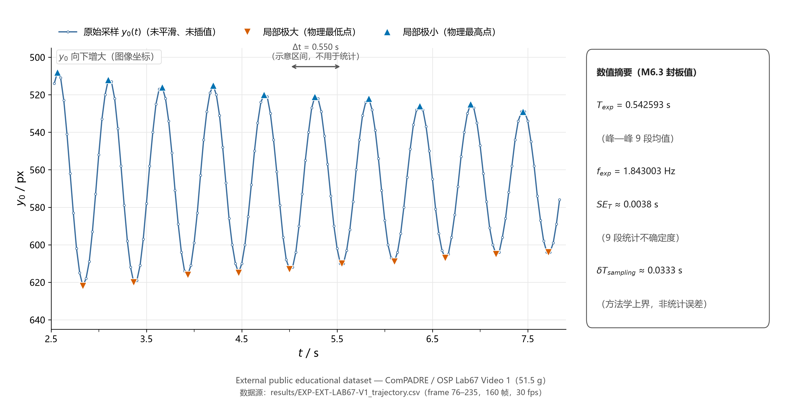
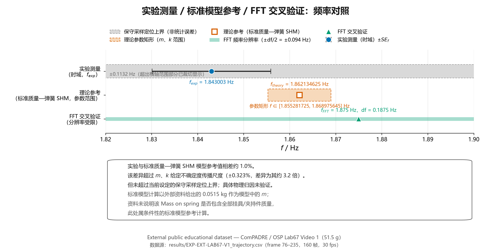
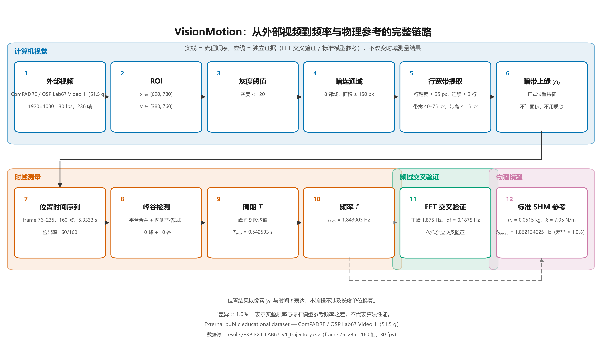

# VisionMotion 阶段成果报告（M6.3 整合版）

| 项目 | 说明 |
| --- | --- |
| 报告定位 | 本科生光电 / 机器视觉方向的项目阶段成果报告（科研报告 + 工程项目报告） |
| 报告范围 | M6.2（外部视频视觉特征选择与正式轨迹实现）与 M6.3（周期与频率测量、频域交叉验证、标准模型条件性对照、证据边界分析） |
| 数据性质 | External public educational dataset（外部公开教育实验数据，**不是**本项目自行采集的实验数据） |
| 数值基准 | 本报告全部科学数值均直接取自已经封板的 M6.2-2C、M6.3-1、M6.3-1R、M6.3-2A、M6.3-2B、M6.3-2C-R 结果；未在本报告中重新计算周期、频率、极值、FFT、理论值、不确定度、参数矩形或差异百分比 |

---

## 摘要

本项目使用一段外部公开的弹簧—质量振荡教学实验视频（ComPADRE / OSP Lab67 Video 1，质量标签 51.5 g），实现了一条从原始视频到“位置时间序列 → 主振动周期与频率 → 频域交叉验证 → 标准模型条件性参考”的完整技术链。视觉部分采用可解释的灰度阈值与几何规则，正式位置特征取悬挂组件暗带的上缘 y₀，在 frame 76–235（160 帧、5.3333 s）上实现 160/160 全检出，未做平滑、滤波、插值与拟合。

时域测量得到主振动周期 T_exp = 0.542593 s、频率 f_exp = 1.843003 Hz；FFT 在其分辨率（df = 0.1875 Hz）内给出主峰 1.875 Hz，作为独立交叉验证；采用标准质量—弹簧简谐振子模型并以外部资料给出的 m = 0.0515 kg、k = 7.05 N/m 作条件性参考计算，得到 T_theory = 0.537018101 s、f_theory = 1.862134625 Hz。两者存在约 1.0% 的差异（周期 +1.0381%、频率 −1.0274%）：该差异超过 m、k 给定不确定度的传播尺度（±0.3228%），但周期差异没有超过本项目设定的保守采样定位上界 ±0.0333 s，对应的频率差异也没有超过其对应的保守采样定位上界 ±0.1132 Hz。由于缺少弹簧自身质量、挂具/夹持件总质量与阻尼参数等独立测量，当前不能将该差异归因于某一个具体物理因素。

**关键词**：机器视觉；非接触位移测量；弹簧振子；周期与频率；FFT；证据边界

---

## 1. 项目概述

VisionMotion 是一个基于计算机视觉的低成本、非接触式位移与振动监测项目。其基本思路是：用普通摄像设备记录目标运动，通过图像处理从视频中提取目标位置的时间序列，再据此得到位移、周期与频率等振动特征。

本阶段的研究目标：

1. 从外部公开实验视频中提取振荡目标的**位置时间序列**；
2. 由位置序列测量**主振动周期 T**；
3. 由周期得到**主振动频率 f**；
4. 使用 **FFT** 做频域交叉验证；
5. 使用**标准质量—弹簧 SHM 模型**做条件性数值参考；
6. 分析实验值与参考值之间的差异，并明确该差异的**证据边界**。

需要同时明确，本阶段**并未完成**以下内容：

- 本阶段未为外部公开视频建立并应用有效的动态 px/mm 标定，因此正式结果仍以像素位置 y₀ 表达，未进行毫米位移换算；
- 高级目标检测方法（如学习类检测器）；
- 数字图像相关（DIC）；
- 深度学习类方法；
- Kalman 滤波等状态估计方法；
- 有限元等数值仿真；
- 阻尼参数反演；
- 等效质量（有效质量）反演。

---

## 2. 数据源

本阶段使用的全部数据来自一处**外部公开教育实验数据集**：

| 项目 | 内容 |
| --- | --- |
| 数据来源 | ComPADRE / Open Source Physics（OSP），条目 ID = 16081，“Teaching Harmonic Motion Online Using Tracker” |
| 资源作者 / 权益持有人 | Kathleen Koenig |
| 许可 | CC BY-NC-SA 3.0 |
| 使用视频 | Lab67 Video 1（质量标签 51.5 g，即 0.0515 kg） |
| 视频参数 | 1920 × 1080，30 fps，236 帧，总长度约 7.87 s |
| 视频 SHA-256 | `dbc81382e93d2b531b7390f1d52f275da5ea9731a9eec9aadb059667944e282d` |
| 正式分析区间 | frame 76–235，共 160 帧，5.3333 s（连续、无缺口） |
| 数据性质 | **External public educational dataset**（非本项目自行采集） |

**正式轨迹数据文件**：`results/EXP-EXT-LAB67-V1_trajectory.csv`（SHA-256 `2604e9af7c34f3ea6198117716ef2b43d352469687b3670d26e4e02a153b4e67`）。

该文件的数据结构（字段名仅在此处出现一次，正文其余部分统一使用数学变量 y₀）：

```
frame, time_s, detected, x_px, y0_px, bbox_w_px, bbox_h_px, area_px
```

表中第 5 列为**本项目的正式位置特征（暗带上缘，单位 px）**，其余数值列仅作质量控制记录。正式轨迹只包含 frame 76–235，共 160 行；本报告正文其余部分统一使用数学变量 y₀ 表示该位置特征。

---

## 3. 视觉测量方法

### 3.1 方法链

```
外部视频 → ROI → 灰度阈值 → 暗连通域 → 行宽带 → 暗带上缘 y₀ → 位置时间序列 y₀(t)
```

### 3.2 正式检测规则（M6.2-2B 冻结）

| 环节 | 规则 |
| --- | --- |
| ROI | x ∈ [690, 780)，y ∈ [380, 760)（图像坐标） |
| 灰度阈值 | gray < 120 |
| 暗连通域 | 8 邻域连通，面积 ≥ 150 px |
| 行宽带 | 逐行统计暗像素水平跨度；连续行跨度 ≥ 35 px 且连续 ≥ 3 行 |
| 几何筛选 | 带宽 40–75 px，带高 ≤ 15 px |
| 多候选处理 | 取面积最大的合格暗带（不使用预测器、不使用滤波） |
| **正式位置特征** | **暗带上缘 y₀** |

正式位置特征经过专门论证后**取暗带上缘**，而**不是**面积、暗像素质心或暗带下缘：由于该暗带的下缘位于渐变过渡区（对姿态与阈值更敏感），上缘对应暗带宽度的强阶跃变化处，在本数据中具有更好的重复性；同时上缘与带高 h 之间不存在代数耦合（而带中心为 y₀ + (h−1)/2、下缘为 y₀ + (h−1)）。

### 3.3 追踪结果与有效区间

- 正式轨迹区间 frame 76–235（160 帧）内 **160/160 帧成功检出**，无缺口、无锁错帧；
- frame 0–73 为释放前/释放过渡阶段，仅作诊断与身份参考，**不进入正式轨迹**；
- frame 74–75 在冻结规则下无法形成合格暗带，**保持缺失**，未通过放宽规则强行补值；
- 质量控制量（仅记录，不作为位置）：x 中心约 718.5–728.0 px，带宽 55–59 px，带高 4–13 px，暗带面积 226–658 px。

---

## 4. 位置信号 y₀(t)

正式位置信号由 160 个原始采样点构成，y₀ 的范围为 **508–622 px**。本阶段对该信号**未做平滑、未做滤波、未做插值**，所有后续时间域分析均直接基于原始采样序列。

由于 y₀ 是图像坐标中的位置特征，其数值增大表示目标在图像中**向下**移动；在最终成果图中，纵轴按图像坐标反向显示，使画面中的“上”对应物理上的“高”。



**图 1（对应文件 `results/EXP-EXT-LAB67-V1_fig_A_y0_timeseries.png`）**：图 1 展示视觉测量实际得到的原始位置时间序列，而不是后处理后的理想化曲线。图中同时给出 10 个局部极大、10 个局部极小与一处代表性峰—峰区间标注（仅作示意，不用于统计）。

---

## 5. 峰谷与周期测量

### 5.1 极值定义

- **y₀ 的局部极大 = 物理最低点**；
- **y₀ 的局部极小 = 物理最高点**。

极值判定采用明确、可复现的规则：先把相邻相同取值合并为“平台块”并取块内帧号中点，再在合并后的序列上用两侧严格不等号判定极值；全过程不使用阈值筛选，也不人工挑选或以任何方式修改极值位置。

### 5.2 封板极值清单（10 个峰 + 10 个谷）

| 类型 | frame | t / s | y₀ / px |
| --- | --- | --- | --- |
| 峰（物理最低点） | 85 | 2.8333 | 622 |
| 峰 | 101 | 3.3667 | 620 |
| 峰 | 118 | 3.9333 | 616 |
| 峰 | 134 | 4.4667 | 615 |
| 峰 | 150 | 5.0000 | 613 |
| 峰 | 166.5 | 5.5500 | 610 |
| 峰 | 183 | 6.1000 | 609 |
| 峰 | 199 | 6.6333 | 607 |
| 峰 | 215 | 7.1667 | 605 |
| 峰 | 231.5 | 7.7167 | 604 |
| 谷（物理最高点） | 77 | 2.5667 | 508 |
| 谷 | 93 | 3.1000 | 512 |
| 谷 | 110 | 3.6667 | 516 |
| 谷 | 126 | 4.2000 | 515 |
| 谷 | 142 | 4.7333 | 520 |
| 谷 | 158 | 5.2667 | 521 |
| 谷 | 175 | 5.8333 | 522 |
| 谷 | 191 | 6.3667 | 526 |
| 谷 | 207 | 6.9000 | 525 |
| 谷 | 223.5 | 7.4500 | 529 |

其中 166.5、223.5、231.5 为 2 帧平台块的中点（分别对应 frame 166–167、223–224、231–232）。

### 5.3 周期与频率

周期主要采用**峰—峰间隔**（9 个峰值之间的 9 段间隔）：

- **T_exp = 0.542593 s**（9 段峰—峰间隔均值）
- **f_exp = 1.843003 Hz**（= 1 / T_exp）

一致性交叉检查（同一批封板极值）：

| 方法 | 结果 |
| --- | --- |
| 峰—峰间隔（9 段） | 0.542593 s |
| 谷—谷间隔（9 段） | 0.542593 s |
| 半周期法（19 段，2 × 均值） | 0.542105 s |

三种时间域方法的结果在**当前数据分辨率范围内一致**（互差 ≤ 0.09%）。单帧最大位置变化 |Δy₀| = 21 px，无超过 30 px 的异常跳变，说明本区间内未出现误锁或异常跳点。

---

## 6. FFT 频域交叉验证

对**原始** y₀(t) 序列（仅减去均值，不做去趋势、不加窗、不补零、不重采样）做实数 FFT，得到：

| 量 | 值 |
| --- | --- |
| FFT 主峰频率 f_FFT | **1.875 Hz** |
| 频率分辨率 df | **0.1875 Hz** |
| 记录长度 | 5.3333 s |

需要明确两点：

1. **FFT 仅作为独立的频域交叉验证**，不替代时域峰—峰周期测量；本报告的中心频率取自时域结果。
2. FFT 的频率分辨率受有限记录长度与采样率限制（df = 0.1875 Hz）；1.875 Hz 与 1.843003 Hz 之间的差异（1.74%）小于该分辨率对应的半格（0.094 Hz，约 5.09%），因此**不能把 1.875 Hz 视为比 1.843003 Hz 更“正确”的结果**，两者属于不同方法在同一数据上的一致性确认。

---

## 7. 标准质量—弹簧 SHM 参考

### 7.1 模型与来源声明

本阶段采用**标准质量—弹簧简谐振子模型**作为参考：

T = 2π √(m / k)　　f = (1 / 2π) √(k / m)

**重要说明**：该理论模型是**本项目采用的标准 SHM 理论模型**，**不是**由外部实验资料明文给出的完整理论公式。外部教学资料在实验要求中让学生“自行查找/陈述该理论模型”，其本身并未写出周期公式；因此本报告在引用该模型时，始终将其标注为“项目采用的标准模型”。

### 7.2 参数来源（外部资料明示值）

| 参数 | 数值 | 不确定度 | 来源 |
| --- | --- | --- | --- |
| 悬挂质量 m（Lab67 Video 1） | 0.0515 kg | ±0.00005 kg | `Equipment values - IV is Amount of Mass on Srping.pdf`（Independent Variable：video 1 → mass on spring = 0.0515 kg） |
| 弹簧常数 k | 7.05 N/m | ±0.045 N/m | 同一资料（Control Variables：Spring Constant (k) = 7.05 N/m） |

### 7.3 条件性声明（必须与结果同时出现）

> 标准模型计算以外部资料给出的 0.0515 kg 作为模型中的 m；资料未说明该 Mass on spring 是否包含全部挂具/夹持件质量，此处属**条件性的标准模型参考计算**。

本报告不讨论、也不引入任何有效质量修正；不进行 k_eff、m_eff、阻尼比、阻尼系数或弹簧质量参数的反演。

### 7.4 参考值

| 量 | 值 |
| --- | --- |
| T_theory | **0.537018101 s** |
| f_theory | **1.862134625 Hz** |

---

## 8. 实验与理论参考差异

| 量 | 实验值 | 标准模型参考值 | 差值 | 相对差异 |
| --- | --- | --- | --- | --- |
| 周期 T | 0.542593 s | 0.537018101 s | **ΔT = +0.005574899 s** | **+1.0381%** |
| 频率 f | 1.843003 Hz | 1.862134625 Hz | **Δf = −0.019131625 Hz** | **−1.0274%** |

为便于阅读，上述差异统一概括为**约 1.0%**。

参数边界检查：由 m、k 各自的不确定度构成的**参数矩形**给出

f ∈ [1.855281725, 1.868975645] Hz（对应 T ∈ [0.535052451, 0.539001698] s）。

实验频率 f_exp = 1.843003 Hz **位于该参数矩形下界之外**（低于下界约 0.0123 Hz）；实验周期 T_exp = 0.542593 s 亦高于对应的周期上界。

需要严格限定表述：在当前参数与标准模型参考计算下，实验结果与参考值之间存在约 1% 的差异。**不**将其解释为“模型错误”“算法错误”或“实验错误”。



**图 2（对应文件 `results/EXP-EXT-LAB67-V1_fig_B_frequency_comparison.png`）**：图中以不同视觉元素区分三类证据——实验测量（时域，实心圆 + 统计标准误误差棒）、理论参考（空心方块 + 参数矩形带）、FFT 交叉验证（三角形 + 分辨率段）；保守采样定位上界以浅灰虚线带单独表示，与统计误差棒在视觉与语义上均不混同。

---

## 9. 不确定度与证据边界

本报告严格区分**三个层次**的不确定度，三者**不合并、不相加**。

| 层次 | 名称 | 数值 | 来源 | 是否实测 |
| --- | --- | --- | --- | --- |
| **A** | m、k 给定不确定度的一阶传播尺度 | 周期约 ±0.3228%（δT_param ≈ ±0.0017336 s）；频率约 ±0.006011 Hz | 外部资料给出的 m、k 不确定度（±0.00005 kg、±0.045 N/m）经一阶传播 | 否（资料给定值） |
| **B** | 实验统计不确定度 | SE_T ≈ 0.0038 s；SE_f ≈ 0.0129 Hz | 由当前 9 个峰间周期样本得到的统计标准误尺度 | 是 |
| **C** | 采样保守定位上界 | δT_sampling ≈ 0.0333 s；δf_sampling ≈ 0.1132 Hz | ±0.5 frame/极值的采样假设（30 fps 下 1 frame = 0.0333 s） | 否（方法学上界） |

三点说明：

1. **A**：实验与参考值之间的差异相对于该参数传播尺度较大（约 3.2 倍），但本报告不使用“完全解释”或“完全解释不了”这类断言。
2. **B**：SE 是**统计量**，由当前 9 个峰间周期样本得到，属于统计标准误尺度，**不是**误差覆盖边界，也不写作“68% 误差范围”。
3. **C**：δT_sampling / δf_sampling 是**方法学上的保守上界**，**不是统计误差**；它与 B 描述同一批极值时刻的不同侧面，二者不可合并。

**边界结论**：

> 当前实验与参考模型之间的差异**超过** m、k 不确定度传播尺度，但**没有超过**本项目设定的保守采样定位上界。

必须同时明确：上句并不表示该差异已由采样相关因素完全解释。

---

## 10. 可能影响结果的因素（未验证因素）

下列因素在标准物理图像下是**合理的可能影响因素**，但本项目**没有足够的独立实验数据**证明其中哪一个是实际主导因素；因此本节只作列举，不作因果关系断言：

- 弹簧自身质量（本阶段资料未给出其数值）；
- 挂具 / 夹持件总质量是否计入质量标签（外部资料未说明）；
- 阻尼（本阶段未做任何阻尼参数拟合或反演）；
- 非理想弹簧特性（如超出胡克定律范围的行为）；
- 系统摩擦与接触效应；
- 位置特征 y₀ 在运动模糊条件下的定位偏移；
- 30 fps 帧采样对极值时刻定位的限制；
- 正式数据记录长度有限（5.3333 s）。

上述因素**目前无法区分其相对贡献**。

---

## 11. 项目技术链与成果展示



**图 3（对应文件 `results/EXP-EXT-LAB67-V1_fig_C_pipeline.png`）**：完整技术链为

```
外部视频 → 视觉 ROI → 灰度阈值 / 暗连通域 / 行宽带 → 暗带上缘 y₀
        → 位置时间序列 → 峰谷检测 → 周期 T → 频率 f
```

图中以四个分组区分方法层级：**计算机视觉**（视频→位置特征）、**时域测量**（位置序列→周期与频率）、**频域交叉验证**（FFT）、**物理模型**（标准 SHM 参考）。

需要强调：**FFT 与标准 SHM 参考属于独立证据，不是对时域结果的“精修”步骤**——它们分别从频域与物理模型两侧对时域测量结果做一致性检查，其结论不改变时域测量本身的数值。

---

## 12. 项目限制

1. 使用**外部公开视频**，而非自主实验采集数据；实验条件（载荷构成、拍摄布置）由外部资料决定。
2. 当前仅有**单一视频、单一质量**（Lab67 Video 1，51.5 g），未做跨质量、跨视频的一致性验证。
3. 视频为 **30 fps**，限制了极值时刻的时间定位精度（单帧 0.0333 s）。
4. 正式位置结果仍以**像素位置 y₀**表达，未进行毫米位移换算。
5. 本阶段未为外部公开视频建立并应用有效的动态 px/mm 标定，因此尚不能给出以毫米为单位的位移与振幅。
6. 正式数据**记录长度有限**（5.3333 s），频域分辨率受限（df = 0.1875 Hz）。
7. 未进行阻尼、有效质量等物理参数的**独立测量**，因此无法对“约 1% 差异”作物理归因。
8. 综合以上，本项目当前阶段属于**“视觉测量与方法验证”**，验证了从视频到周期/频率及其边界分析的完整技术链；它**还不是**一套完整的高精度实验力学测量系统。

---

## 13. 结论

在本公开实验视频与当前测量流程下，视觉方法得到的主振动频率为约 **1.843 Hz**（T_exp = 0.542593 s）；采用标准质量—弹簧简谐振子模型、以外部资料给出的 m、k 计算得到约 **1.862 Hz**（T_theory = 0.537018101 s）。两者存在约 **1.0%** 的差异（周期 +1.0381%、频率 −1.0274%）：该差异**超过** m、k 给定不确定度传播的尺度（±0.3228%），但周期差异**未超过**当前设定的保守采样定位上界 ±0.0333 s，对应的频率差异也未超过其对应的保守采样定位上界 ±0.1132 Hz；由于缺少弹簧自身质量、挂具总质量与阻尼参数等独立测量，当前**不能将该差异归因于某一个具体物理因素**。

本阶段得到的可复现成果包括：一套可解释的视觉位置提取规则、一份 160 帧的正式位置时间序列（`results/EXP-EXT-LAB67-V1_trajectory.csv`）、一组时域与频域交叉验证的周期/频率结果，以及明确分层的不确定度与证据边界说明。

---

## 14. 参考资料

1. **ComPADRE / Open Source Physics（OSP）**，条目 ID = 16081，“Teaching Harmonic Motion Online Using Tracker”；Lab67 Video 1（质量标签 51.5 g）；作者 / 权益持有人 Kathleen Koenig；许可 CC BY-NC-SA 3.0。本地文件 `_external/_candidates/candidate_comPADRE_Lab67_01_Video1_51p5g.mp4`，SHA-256 `dbc81382e93d2b531b7390f1d52f275da5ea9731a9eec9aadb059667944e282d`（1920 × 1080，30 fps，236 帧）。
2. **`Equipment values - IV is Amount of Mass on Srping.pdf`**（含于 Lab67 归档 `candidate_comPADRE_Lab67.zip` 内，SHA-256 `180587ec6a31b494453d7635ca5985b48bfc1de07675c4f3cdaf34378eb3d49a`，1 页）：给出 k = 7.05 N/m（±0.045 N/m）、video 1 → mass on spring = 0.0515 kg（±0.00005 kg）、释放前下拉距离 = 0.05 m（±0.005 m）。
3. **`FS20 - Labs 06 and 07 -Simple Harmonic Motion.pdf`**（同一归档内，SHA-256 `223125d064f6c55c5a4b501c9536807e3bcffc0209868973daa5866c13b95467`，7 页）：实验指导资料，说明研究问题为“质量对弹簧振子周期的影响”，并要求学生自行查找与陈述理论模型（该资料本身未给出周期公式）。
4. **项目内部数据（本阶段产物）**：
   - `results/EXP-EXT-LAB67-V1_trajectory.csv`（正式位置时间序列，SHA-256 `2604e9af7c34f3ea6198117716ef2b43d352469687b3670d26e4e02a153b4e67`）；
   - `results/EXP-EXT-LAB67-V1_fig_A_y0_timeseries.png`、`results/EXP-EXT-LAB67-V1_fig_B_frequency_comparison.png`、`results/EXP-EXT-LAB67-V1_fig_C_pipeline.png`（本报告图 1–图 3）；
   - `src/external_oscillation_tracker.py`、`demo/run_m62_external_tracking.py`（正式轨迹提取流程）；
   - `src/m63_final_visualization.py`、`demo/run_m63_final_visualization.py`（最终成果图生成流程）。

> 说明：以上资料均为项目中已经实际存在、并有来源记录的文件；本报告未引入任何未经验证的外部文献或网页。

---

## 附录 A　封板数值一览（便于核对，未在本报告中重新计算）

| 类别 | 量 | 封板值 |
| --- | --- | --- |
| 视频 | 分辨率 / 帧率 / 总帧数 | 1920 × 1080 / 30 fps / 236 帧 |
| 正式区间 | 帧范围 / 帧数 / 时长 | frame 76–235 / 160 帧 / 5.3333 s |
| 位置信号 | y₀ 范围 | 508–622 px |
| 极值 | 数量 | 10 峰 + 10 谷 |
| 时域 | T_exp / f_exp | 0.542593 s / 1.843003 Hz |
| 频域 | f_FFT / df | 1.875 Hz / 0.1875 Hz |
| 参考 | T_theory / f_theory | 0.537018101 s / 1.862134625 Hz |
| 差异 | ΔT / Δf | +0.005574899 s（+1.0381%）/ −0.019131625 Hz（−1.0274%） |
| 参数矩形 | f 范围 | 1.855281725 – 1.868975645 Hz |
| 不确定度 A | T / f 传播尺度 | ±0.3228% / ±0.006011 Hz |
| 不确定度 B | SE_T / SE_f | ≈ 0.0038 s / ≈ 0.0129 Hz |
| 不确定度 C | 采样保守上界 | ≈ 0.0333 s / ≈ 0.1132 Hz |
